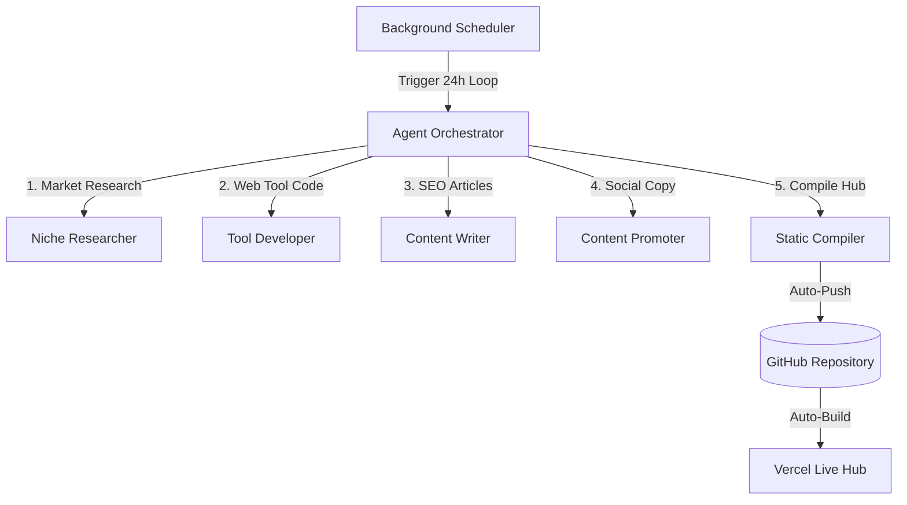

# Aegis-100K: Autonomous Wealth-Building System for Developers

Aegis-100K is an AI-driven, multi-agent sandbox that autonomously builds, compiles, and deploys high-utility developer tools, interactive web components, and SEO-optimized educational guides to drive organic search traffic and generate passive affiliate and ad revenue.

---

## 1. Project Goal & Purpose

The ultimate objective of Aegis is to build a high-authority, organic traffic hub targeting developer productivity and frontend utility niches. Developers frequently search for visual utilities (e.g. cheat sheets, converters, code generators). Aegis captures this intent by generating:
1. **Interactive SaaS Tools:** Single-page utilities that solve specific developer friction points.
2. **SEO-Optimized Articles:** Companion guides explaining how to use these tools, naturally integrating keywords.
3. **Monetized Gateways:** Direct digital goods sales (PDFs, templates, boilerplates) and display ads.

---

## 2. System Architecture & Mechanics

Aegis coordinates four specialized agents using the **Google Antigravity SDK**, running on a 24-hour scheduler loop:



### The 4-Stage Agent Pipeline
1. **Niche Researcher ([agents/researcher.py](agents/researcher.py)):** Uses Web Search to identify low-competition developer keywords, affiliate programs, and micro-SaaS opportunities.
2. **Tool Developer ([agents/developer.py](agents/developer.py)):** An elite front-end engineering agent that writes self-contained, responsive, dark-mode single-page HTML utilities (with embedded CSS and JS).
3. **Content Writer ([agents/writer.py](agents/writer.py)):** An SEO copywriter that generates educational guides and newsletters containing targeted keywords and disclaimers.
4. **Content Promoter ([agents/promoter.py](agents/promoter.py)):** Drafts platform-specific growth campaigns for X, Reddit, LinkedIn, and Pinterest to drive social traffic.

---

## 3. Static Compiler & Legal Compliance ([publish.py](publish.py))

Following each iteration, the static compiler processes the historical runs in `data/history.json`:
* **Index Compilation:** Re-builds the landing page index hub with dynamic card descriptions.
* **Canonical URL Normalization:** Injects `<link rel="canonical" href="...">` pointing to your custom domain to optimize SEO indexing.
* **Australian & Global Legal Compliance:** Injects Australian Privacy Principles (APPs), GDPR, and ASIC disclaimers into footers and disclosure sections.
* **Affiliate & Ad Placement:** Automatically injects a "Sponsored Developer Resources" grid dynamically populated from your `.env` settings.
* **Git Sync:** Commits and pushes the completed static pages to your remote repository, triggering an automatic Vercel production rebuild.

---

## 4. Telemetry Dashboard ([dashboard/app.py](dashboard/app.py))

A background FastAPI server serves a local telemetry dashboard at `http://127.0.0.1:8000/`:
* **Real-time Logs:** Monitor background scheduler status and agent execution history.
* **Manual Trigger:** Manually trigger a new pipeline run for a custom seed topic.
* **Hub Preview:** Click the "Preview Hub" button or navigate directly to `/hub` to view your compiled local sandbox.

---

## 5. Setup & Environment Variables

Create a local `.env` file at the root directory:

```env
# Gemini API Key (cloud API support)
GEMINI_API_KEY=your-api-key

# Model Backend ("gemini" or "ollama")
MODEL_BACKEND=gemini

# Custom Domain canonical target
AEGIS_CUSTOM_DOMAIN=aegisdev.com


# Affiliate Links JSON dictionary
AFFILIATE_LINKS_JSON='{"digitalocean": "https://m.do.co/c/your-tag", "vercel": "https://vercel.com/v0", "hosting": "https://hostinger.com?referral=your-tag"}'
```
